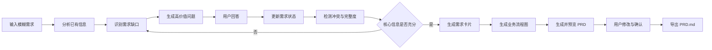
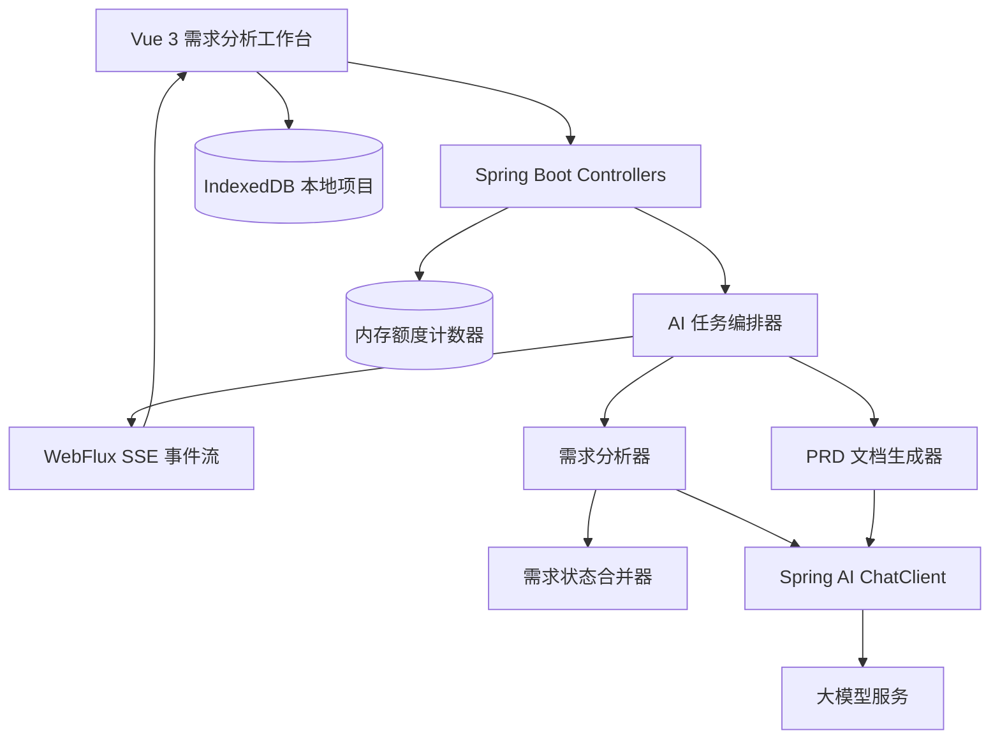

# Prompt2PRD 产品设计文档

> 文档版本：V1.1  
> 文档状态：需求设计已确认  
> 更新日期：2026-07-17

## 1. 产品概述

### 1.1 产品名称

Prompt2PRD

### 1.2 产品定位

Prompt2PRD 是一个面向 vibe coding 用户的 AI 需求分析与工程规划工作台。用户只需输入一句模糊的产品想法，系统便会识别其中缺失的关键信息，通过多轮、自适应的问题向导逐步澄清需求，并将回答实时整理为结构化需求卡片，最终生成业务流程图、架构建议和可编辑、可导出的 AI-ready PRD。

AI-ready PRD 的主要下游使用者是 Codex、Claude Code、Cursor 等 coding agent，而不只是人工产品或开发人员。文档需要让 AI 明确知道“做什么、不要做什么、采用什么架构、按什么顺序实现、怎样判断完成”，从而减少用户在 vibe coding 过程中反复补充上下文和修正错误方向。

Prompt2PRD 不把大模型当作一次性文档生成器，而是将需求分析拆分为“信息提取、缺口识别、动态追问、状态合并、冲突检测、架构推荐和工程文档生成”等可控制环节，让用户在生成过程中持续确认需求与技术选择，降低大模型遗漏信息、擅自假设和前后矛盾的风险。

### 1.3 产品愿景

让主要依靠 AI 辅助编程的用户，也能把一个模糊想法逐步转化为 coding agent 可理解、可分步实施、可测试和可验收的工程化产品文档。

### 1.4 核心价值

- 降低需求分析门槛：从一句话开始，不要求用户先编写初始 PRD。
- 提高需求完整性：围绕角色、流程、规则、异常和验收条件主动发现信息缺口。
- 提高生成可控性：用户可以确认、修改和锁定需求，避免 AI 随意覆盖已确认内容。
- 提高交付效率：自动生成需求卡片、流程图、页面清单、接口清单和 PRD.md。
- 降低 AI 编程偏航：生成明确的架构选择、数据模型、目录建议、实施阶段和禁止事项。
- 提高上下文复用：用户可以把同一份 PRD 交给不同 coding agent，而不必重新解释核心需求。
- 保留分析依据：记录问题、回答、假设、冲突和版本变化，使需求演进过程可追踪。

## 2. 背景与问题

用户通常只能描述一个宽泛的产品想法，例如：

> 我要做一个宠物寄养平台。

这句话不足以直接指导设计和开发，其中缺少用户角色、平台模式、支付方式、审核机制、订单规则、事故责任等大量关键信息。普通生成式 AI 往往会直接补全这些信息并输出一份看似完整的方案，但其中可能包含未经用户确认的假设，也容易遗漏异常场景和验收条件。

Prompt2PRD 首先识别“当前还不知道什么”，再按照业务影响和风险程度选择最值得询问的问题。只有当核心信息达到一定完整度后，系统才进入正式文档生成阶段。

## 3. 产品目标与非目标

### 3.1 第一阶段目标

- 支持用户通过一句自然语言、较长需求描述或上传 Markdown/TXT 文件创建需求项目。
- 自动识别需求中的已知信息、隐含假设和信息缺口。
- 每轮批量生成 5～10 个高价值澄清问题。
- 支持单选、多选、文本和确认类回答方式。
- 问题可以提供 AI 推荐选项，但始终允许用户填写自定义答案。
- 根据用户回答实时更新结构化需求卡片。
- 识别需求之间的潜在冲突并要求用户确认。
- 展示需求完整度及仍待确认的内容。
- 生成覆盖核心主流程和异常流程的 Mermaid 业务流程图。
- 根据用户技能、项目规模、部署条件和成本约束提供架构候选方案及推荐结论。
- 在用户确认架构后生成数据模型、项目结构建议和分阶段实施计划。
- 生成包含固定章节的 PRD，并导出为 Markdown 文件。

### 3.2 暂不包含

- 自动生成高保真 UI 设计稿。
- 面向手机浏览器的移动端专项适配和原生 App。
- 自动创建完整可运行项目代码。
- 多人实时协作和复杂权限管理。
- 企业级知识库、审批流和组织管理。
- Word、PDF 等多格式导出。
- 整个项目的 JSON 备份与恢复。
- 与 Jira、飞书、Notion 等外部平台集成。
- 作为官方在线服务公开部署和运营。

上述能力可在核心闭环验证后逐步扩展。

## 4. 目标用户

### 4.1 独立开发者

本产品的第一核心用户，尤其是主要使用 vibe coding 的个人开发者。他们有产品想法和一定开发基础，但缺少系统化需求分析或架构设计经验，希望生成一份可以直接交给 coding agent 的实现依据。

### 4.2 学生开发者

需要完成课程设计、毕业设计或个人作品，希望将模糊选题整理成结构完整的产品文档。

### 4.3 初级产品经理

需要快速整理业务方的口头需求，发现遗漏的问题，并形成可评审的初版 PRD。

### 4.4 小型创业团队

处于想法验证或 MVP 阶段，希望用较低成本统一产品、设计和开发人员对需求的理解。

## 5. 核心使用场景

### 5.1 从模糊想法创建 PRD

用户输入“我要做一个宠物寄养平台”，系统识别业务类型和信息缺口，经过多轮追问后生成结构化 PRD。

### 5.2 补充已有需求描述

用户粘贴一段初步需求，系统提取其中已明确的内容，只对缺失、模糊或相互冲突的部分进行追问。

### 5.3 检查需求完整性

用户查看需求完整度、待确认项和异常场景，补充容易在开发阶段引起返工的业务规则。

### 5.4 修改并重新生成局部内容

用户修改某项业务规则后，系统标记受影响的流程、页面、接口和验收标准，只重新生成相关内容，而不是覆盖整份文档。

### 5.5 获取适合自己的架构建议

主要使用 vibe coding 的用户说明自己会 Vue、Java 和 Spring Boot，并选择单机 Docker 部署。系统比较全栈 JavaScript、Vue + Spring Boot 等方案后，优先推荐学习成本更低且符合现有能力的架构，并说明何时应该选择其他方案。

### 5.6 将 PRD 交给 coding agent

用户完成需求和架构确认后导出 AI-ready PRD，将其作为上下文提供给 Codex、Claude Code、Cursor 等工具。Coding agent 可以从文档中读取技术约束、数据模型、接口契约、实施顺序和验收条件，而不需要用户重新口头解释项目。

## 6. 核心产品原则

### 6.1 先澄清，后生成

系统不得在核心需求明显不足时直接生成最终 PRD。用户可以主动跳过追问，但文档必须明确标记未经确认的假设。

### 6.2 批量展示高价值问题

每轮展示 5～10 个问题，让用户可以集中回答同一分析阶段的关键信息。问题应按照业务影响和风险程度排序，并通过清晰的分类和回答控件降低批量填写负担，避免形成无重点的冗长问卷。

### 6.3 区分事实、假设与建议

- 已确认事实：用户明确输入或确认的内容。
- AI 假设：为保证文档连贯而提出、但尚未得到确认的内容。
- AI 建议：系统根据常见业务模式提供的可选方案。

三类内容必须在界面和最终文档中具有不同标识。

### 6.4 用户确认优先

用户已经确认并锁定的需求不能被后续模型输出直接覆盖。若新回答与锁定内容冲突，系统必须创建冲突项并交由用户处理。

### 6.5 结构化状态优先于聊天记录

聊天或问答记录只作为分析证据，结构化需求状态才是生成流程图和 PRD 的唯一正式数据来源。

### 6.6 输出语言跟随用户

系统根据用户的初始需求和主要回答自动识别项目语言，问题、需求卡片、流程图节点和 PRD 默认使用同一种语言。用户偶尔输入其他语言时不应导致整个项目语言来回切换。

## 7. 产品流程



### 7.1 创建项目

1. 用户输入产品想法或粘贴已有需求描述。
2. 系统创建需求项目并启动流式分析。
3. 页面逐步显示已识别的产品目标、业务对象和初步角色。
4. 系统生成第一轮关键问题。

### 7.2 多轮需求澄清

1. 用户回答当前问题。
2. 系统提取新增事实并更新需求状态。
3. 系统检查重复信息、矛盾规则和新增缺口。
4. 系统重新计算需求完整度。
5. 未达到生成条件时，选择下一批问题继续询问。

### 7.3 生成与导出

1. 核心需求达到生成条件后，系统按章节生成 PRD。
2. 用户可查看需求卡片和流程图，并修改未锁定内容。
3. 修改内容影响其他章节时，系统给出关联更新提示。
4. 用户确认后导出 `PRD.md`。

## 8. 信息架构与页面清单

MVP 采用面向电脑浏览器的 Web 工作台，不承担移动端专项适配。整体信息架构借鉴明道云的应用工作台：用稳定的侧边导航承载模块入口，用宽阔主画布承载当前任务，用抽屉或辅助面板展示上下文信息。只借鉴工作台层级与交互方式，不复制明道云的品牌、图标或具体页面。

### 8.1 项目首页

首页采用简约的左右布局，不设置独立产品宣传页：

- 左侧固定导航：全部项目、已归档、回收站、模型设置。
- 右侧主内容区：项目列表、筛选排序和“新建项目”按钮。

主要功能：

- 创建新需求项目。
- 从浏览器本地读取并展示多个历史项目、完整度、更新时间和当前阶段。
- 继续编辑、重命名、复制、归档或删除项目。
- 进入回收站恢复项目或永久删除项目。

第一版不要求登录，项目数据保存在当前浏览器中。首页至少提供“创建项目”和“最近项目”，并明确提示清除浏览器数据会导致本地项目丢失。

当没有项目时，右侧显示简洁空状态、产品的一句话说明和“创建第一个项目”按钮，不自动创建示例项目，也不提供宠物寄养等示例需求快捷入口。

### 8.2 新建项目页

主要内容：

- 产品想法输入框。
- Markdown 或 TXT 文件上传入口。
- 上传后的文本内容预览和确认。
- 对上传文件进行补充说明的文字输入区。
- 产品类型或目标平台等可选信息。
- “开始分析”按钮。

### 8.3 需求分析工作台

采用“全局导航 + 项目导航 + 主画布 + 可收起辅助面板”的结构：

- 全局左导航：在全部项目、已归档、回收站和模型设置之间切换。
- 项目二级导航：在需求概览、问题向导、需求卡片、架构建议、流程图和 PRD 之间切换，并显示各模块的完成状态。
- 顶部项目栏：展示项目名称、总完整度、当前模型、保存状态和“生成 PRD”主操作。
- 中央主画布：根据当前模块展示问题表单、需求卡片、架构对比、流程图或 Markdown 编辑器。
- 右侧辅助面板：按需展示 AI 分析进度、待确认假设、冲突和变更记录，可收起，不永久占用编辑空间。

问题向导中可以临时并排显示问题表单和需求摘要，但在 PRD 编辑、流程图查看等需要大画布的场景中，右侧面板默认收起。

项目首页参考明道云应用列表的管理方式，每个项目条目至少展示项目名称、当前阶段、总完整度、待确认数量、更新时间和快捷操作。鼠标悬停后显示重命名、复制、归档和删除入口，避免每张卡片常驻过多按钮。

### 8.4 流程图页面

主要功能：

- 展示由结构化需求生成的 Mermaid 核心主流程图。
- 单独展示异常流程，说明异常触发条件、处理动作和最终状态。
- 支持重新生成和复制 Mermaid 源码。

### 8.5 PRD 预览页

主要功能：

- 在预览模式和编辑模式之间切换。
- 按章节展示和编辑最终 PRD。
- 展示生成进度和章节状态。
- 支持局部重新生成。
- 支持用户编辑并锁定章节。
- 支持导出 Markdown。

### 8.6 模型设置面板

主要功能：

- 选择使用系统提供的 API Key 或用户自己的 API Key。
- 配置兼容 OpenAI API 格式的服务地址、模型名称和必要参数。
- 提供 OpenAI、DeepSeek、通义千问等常用服务的配置预设。
- 测试当前模型配置是否可用。
- 明确提示用户自带 API Key 不会写入项目数据或日志。

### 8.7 视觉设计规范

界面采用浅色、简约、信息清晰的桌面工作台风格。布局层级参考明道云，卡片密度、边框和排版可参考 Airtable 一类结构化生产力工具，但继续使用 Prompt2PRD 自己的颜色和品牌。基础颜色如下：

| Token | 色值 | 用途 |
|---|---|---|
| `--color-primary` | `#c7eb64` | 主按钮、当前菜单、高优先级操作 |
| `--color-accent` | `#249da5` | 重要功能卡片、进度和信息强调 |
| `--color-background` | `#eff3f4` | 页面背景 |
| `--color-surface` | `#ffffff` | 普通卡片、面板 |
| `--color-text-primary` | `#262b25` | 标题和主要文字 |
| `--color-text-secondary` | `#626d72` | 正常字号的辅助说明文字 |
| `--color-text-muted` | `#80898f` | 禁用态、占位符和非关键信息 |
| `--color-on-accent` | `#111713` | 蓝绿色重要卡片上的普通文字 |

使用规则：

- `#c7eb64` 上统一使用 `#262b25` 深色文字，不使用白字。
- `#249da5` 上的普通字号文字使用 `#111713`；白字只用于尺寸足够大的短标题或图标，不用于正文。
- `#80898f` 不承担正常字号的重要辅助说明，正文辅助信息使用对比度更高的 `#626d72`。
- 白色卡片通过间距、细边框和轻阴影与 `#eff3f4` 背景区分，避免过重的后台管理系统视觉。
- 项目列表和需求卡片优先使用清晰边框、轻阴影和紧凑信息层级，不使用大面积渐变或装饰性插画。
- 右侧辅助面板使用抽屉式过渡，打开后不遮挡当前关键操作；主画布宽度不足时优先收起辅助面板。
- MVP 只提供浅色主题，不增加深色模式切换。

## 9. 功能需求

### 9.1 项目管理

#### FR-001 创建需求项目

用户输入不少于 5 个字符的产品描述，或上传包含有效文本的 Markdown/TXT 文件后，可以创建项目。系统保存原始输入、文件解析内容、项目名称、创建时间和当前分析状态。第一版不要求用户注册或登录。

#### FR-001A 上传需求文件

系统支持扩展名为 `.md` 和 `.txt`、大小不超过 2 MB 的文本文件。上传后先解析文本并提供预览，用户确认内容无误后再启动分析。空文件、无法解码的文件和超过 2 MB 的文件不得进入分析流程，界面应说明失败原因。

确认分析后，系统按 Markdown 标题和自然段边界将全文拆分为不超过 32,000 个 Unicode 字符的片段，依次执行结构化提取，再合并、去重并进入正式分析。所有片段都必须被处理，不得静默截断；页面显示已处理片段数、总片段数和取消入口。单 IP 免费额度按一次用户分析操作计数，全局预算按真实上游模型调用次数计数。

用户第一次使用文件上传功能时，系统必须提示：“文件内容将发送给用户选择的大模型服务商进行分析，请勿上传密码、密钥等敏感信息。”用户确认后在浏览器本地记录提示状态，后续上传不再重复弹窗，但上传区域持续显示简短隐私提醒。

#### FR-001B 合并文字与文件输入

用户可以同时上传 Markdown/TXT 文件并输入文字。文件内容作为基础需求材料，文字作为对文件的补充、修改意图或重点说明，两者共同进入分析上下文。若补充文字与文件原文存在明显矛盾，系统不得静默选择其中一方，应生成冲突项要求用户确认。

#### FR-002 自动生成项目名称

创建项目时先使用原始输入前 20 个字符作为临时名称。首次分析成功后，模型返回简短项目名称；如果用户尚未手动重命名，则自动替换临时名称。模型命名失败或用户已经改名时保留当前名称。

#### FR-003 保存分析进度

每次回答和状态更新后自动保存到浏览器 IndexedDB。用户重新进入项目时，应恢复上次的需求状态和未完成问题。第一版允许在同一浏览器中创建、保存和切换多个项目；清除站点数据或更换浏览器后，本地项目不会自动恢复。

#### FR-004 管理多个本地项目

项目首页从 IndexedDB 读取本地项目列表。用户可以创建多个互不影响的需求项目，并按最近更新时间进入项目继续分析。第一版不提供跨设备同步。

#### FR-005 本地项目操作

用户可以对本地项目执行：

- 重命名：只修改项目展示名称，不改变需求内容。
- 复制：创建具有新项目编号的完整副本，并在名称后增加“副本”。
- 归档：从最近项目中隐藏，保留全部项目数据，可以随时取消归档。
- 删除：将项目移入回收站，不立即永久清除数据。

#### FR-006 回收站

回收站展示已删除项目的名称、删除时间和原完整度。用户可以恢复项目，也可以对单个项目执行永久删除。MVP 不自动清空回收站，避免用户在不知情的情况下丢失本地数据；“清空回收站”属于批量破坏性操作，第一版不提供。

### 9.2 需求分析

#### FR-101 提取已知信息

系统从初始描述和用户回答中提取产品目标、目标用户、角色、功能、业务规则和限制条件，并标记信息来源。

#### FR-102 识别信息缺口

系统至少从以下维度检查需求：

- 产品目标与边界
- 用户角色与权限
- 核心业务流程
- 数据对象及状态变化
- 支付、审核或通知等关键能力
- 业务规则
- 异常场景
- 安全与隐私
- 验收标准
- 页面与接口需求

并非所有项目都必须包含全部维度，系统应根据产品类型动态判断适用性。

#### FR-103 动态生成问题

系统每轮生成 5～10 个问题，每个问题包含：

- 问题文本
- 提问原因
- 所属需求维度
- 推荐回答方式
- 可选项及其影响说明（适用时）
- 问题优先级

对于单选和多选题，系统应提供与当前需求相关的 AI 推荐选项，并始终显示“自定义答案”入口。用户可以在选择推荐项的同时补充说明；自定义内容与预设选项具有相同的信息优先级。

#### FR-104 问题优先级

候选问题按照业务影响程度、信息缺失程度、后续依赖数量和风险程度综合排序。涉及交易、权限、安全、责任和核心状态流转的问题应优先展示。

#### FR-105 支持跳过问题

用户可以跳过单个问题，也可以跳过当前整轮问题。跳过后，问题进入待确认列表，不视为已完成，也不能提高对应维度的完整度；用户之后仍可返回补充回答。

#### FR-106 处理“不知道”回答

当用户选择或输入“不知道”时，系统根据当前上下文提供一个推荐方案，并解释该方案对后续流程的主要影响。推荐方案必须保持 `PENDING` 状态，只有用户明确确认后才转为 `CONFIRMED` 并计入完整度；用户拒绝或仍无法判断时，该问题保留在待确认列表。

### 9.3 需求状态管理

#### FR-201 实时更新需求卡片

用户提交回答后，系统应将新增信息合并到对应需求卡片，并通过流式事件通知前端更新。

#### FR-202 状态标识

每条需求至少包含以下状态之一：

- `INFERRED`：AI 根据上下文推测。
- `PENDING`：等待用户确认。
- `CONFIRMED`：用户已经确认。
- `CONFLICTED`：与其他内容存在冲突。

锁定不是需求状态，而是独立的 `locked` 布尔字段。只有 `CONFIRMED` 内容可以设置 `locked = true`；锁定后禁止模型修改或删除，用户必须先解锁才能手动编辑。

#### FR-203 锁定需求

用户可以锁定已确认的角色、功能或规则。后续分析只能引用锁定内容，不能直接修改或删除。

#### FR-204 冲突检测

当新回答与已有需求矛盾时，系统在工作台右侧创建冲突卡片，展示冲突双方、信息来源、影响范围和建议处理方式，由用户选择保留内容或手动填写最终规则。冲突卡片不阻止用户继续回答其他问题，但未解决的核心冲突会阻止项目被标记为“已完成”。

#### FR-205 版本记录

每次需求状态发生有效变化时生成版本记录，至少保存变更时间、变更类型、变更字段、旧值和新值。

用户可以打开版本历史，查看每个版本的变更摘要和详细差异，并选择将当前项目恢复到指定历史版本。执行恢复前自动保存当前版本，避免误操作后无法返回。

MVP 对每次有效变化保存一份可恢复的完整项目快照和一份字段级变更摘要；连续键盘输入只在显式保存、离开编辑模式或一次业务操作完成时生成版本。第一版不自动清理历史版本。

#### FR-206 直接编辑需求卡片

用户可以直接编辑 AI 整理出的角色、功能、业务规则、异常场景等需求卡片。手动编辑后的内容标记为用户确认内容并写入本地版本记录；若该卡片已锁定，用户应先明确解锁再修改。卡片修改后，系统重新计算完整度，并标记可能受影响的流程图和 PRD 章节。

### 9.4 完整度评估

#### FR-301 计算需求完整度

系统按项目适用维度计算完整度，结果范围为 0～100。用户已确认内容得分高于 AI 推测内容，存在冲突或关键问题未回答时扣分。

建议第一版采用可解释的规则评分，而不是完全由大模型直接给出分数。

MVP 使用以下固定权重：

| 维度 | 权重 |
|---|---:|
| 产品目标与范围 | 10% |
| 用户角色与权限 | 8% |
| 核心业务流程 | 15% |
| 功能模块 | 12% |
| 业务规则 | 10% |
| 异常场景 | 8% |
| 数据模型 | 10% |
| 架构与技术约束 | 12% |
| 页面与接口需求 | 8% |
| 验收标准 | 7% |

每个适用维度先根据去重后的目标项计算维度分数：`CONFIRMED` 项记 100%，`INFERRED` 项记 40%，`PENDING` 和 `CONFLICTED` 项记 0%；`locked` 只提供保护，不额外加分。分母包含该维度已有目标项、待补充信息和未回答关键问题；完全没有目标项时记 0 分。存在未解决核心冲突时，该维度最高为 50 分。维度分数和总分均四舍五入为 0～100 的整数，并返回每项得分或扣分原因。

总完整度为所有适用维度得分按上述权重重新归一化后的结果。例如某个维度不适用时，从分母中排除其权重，其余适用维度按比例计算总分。

完整度必须同时展示总分和各维度得分，至少包括：

- 产品目标与范围
- 用户角色与权限
- 核心业务流程
- 功能模块
- 业务规则
- 异常场景
- 数据模型
- 架构与技术约束
- 页面与接口需求
- 验收标准

对于当前项目不适用的维度，应标记为“不适用”并从总分计算中排除，不能按 0 分处理。

#### FR-302 进入生成阶段

满足以下条件时，系统建议用户生成 PRD：

- 产品目标已确认。
- 核心用户角色已确认。
- 至少一条核心业务流程已确认。
- 核心业务规则不存在未解决冲突。
- 已生成架构候选方案，且用户确认了最终架构；未确认时只能生成标记为草稿的 PRD。
- 整体完整度达到 80 分。

达到完整度标准后，系统同时提供“继续回答问题”和“生成 PRD”两个入口，不自动开始生成，也不强制结束需求澄清。用户可以继续补充需求以提高各维度得分。用户也可以在未达到标准时随时生成草稿，但生成前和生成结果中都必须明确显示当前完整度、缺失内容、待确认事项和 AI 假设。

### 9.5 流程图生成

#### FR-401 生成主业务流程

系统根据核心角色、业务动作和状态变化生成 Mermaid 主业务流程图。图中必须标明流程起点、关键决策、主要状态和结束条件，避免只罗列功能模块。

#### FR-401A 生成异常流程

系统根据已确认的异常场景生成一张或多张 Mermaid 异常流程图，至少说明异常的触发条件、责任角色、处理动作、状态变化和结束结果。没有已确认异常场景时，界面应提示用户先补充需求，而不是由模型虚构事故处理规则。

#### FR-402 流程图校验

系统应在保存前分别校验主流程图和异常流程图的 Mermaid 语法。单张图生成失败时保留其他有效结果和需求状态，并允许用户单独重新生成失败的流程图。

### 9.6 架构推荐

#### FR-450 收集技术约束

系统在生成架构方案前，必须确认或询问以下信息：

- 用户已经掌握或愿意使用的技术栈
- 项目类型和目标终端
- 单人项目还是团队项目
- 预计用户量与数据规模
- 是否登录、是否实时通信、是否包含支付等关键能力
- 数据敏感程度
- 本地运行、单机部署、云部署或多实例部署要求
- 预算、开发周期和维护能力

#### FR-451 生成候选架构

系统默认生成 2～3 个可行架构方案，每个方案至少包含前端、后端、数据库或本地存储、鉴权、文件存储、AI 接入、部署方式和测试策略。候选方案不得只罗列技术名称，必须说明各组件在当前项目中的职责。

#### FR-452 给出对比与推荐

系统从学习成本、开发速度、部署复杂度、运行成本、可维护性、扩展性和 coding agent 支持成熟度等维度对候选方案进行对比，并明确标记一个推荐方案。推荐理由必须引用用户已经确认的约束，不能只以“流行”作为依据。

#### FR-453 用户确认架构

用户可以接受推荐方案、选择其他候选方案或手动修改技术选择。只有用户确认后，最终架构才写入正式需求状态并标记为 `CONFIRMED`。后续生成的数据模型、接口、目录结构和实施计划必须以已确认架构为准。

#### FR-454 生成架构设计

最终架构章节至少包含：

- 架构目标和关键约束
- 技术栈与选择理由
- 前端、后端、存储和外部服务职责边界
- 系统上下文图或组件图
- 核心数据模型和状态流转
- API 与流式通信方式
- 安全、错误处理和日志策略
- 本地开发与部署方式
- 推荐项目目录结构
- 已知限制和暂不实现内容

### 9.7 PRD 生成

#### FR-501 分章节生成

AI-ready PRD 至少包含：

1. Coding Agent 使用说明
2. 产品背景、目标与非目标
3. 用户角色与权限
4. 功能模块及优先级
5. 用户故事与功能摘要
6. 核心业务流程与状态机
7. 业务规则和异常场景
8. 已确认架构与技术约束
9. 数据实体、字段、关系和状态
10. 页面清单与页面行为
11. 接口契约、请求响应示例和错误码
12. 安全、性能和其他非功能需求
13. 普通验收规则和 Given/When/Then 场景
14. 分阶段实施计划
15. 测试策略与关键测试用例
16. 明确禁止事项
17. AI 假设、待确认事项和已知限制

#### FR-501A AI 可执行性规则

最终文档必须满足：

- 所有功能、规则、接口、页面和验收条件使用稳定编号，支持相互引用。
- 明确区分 `MUST`、`SHOULD` 和 `MUST NOT`，减少 coding agent 自行猜测。
- 使用已确认的技术栈和目录结构，不在不同章节推荐相互冲突的框架。
- 数据字段、状态枚举、API 参数和错误码保持命名一致。
- 每个实施阶段说明输入、产出、依赖和完成条件。
- 每项核心功能可以追溯到对应用户故事、业务规则和验收标准。
- 未确认内容集中进入待确认事项，不得混入确定性实施指令。
- 不生成大段空泛产品宣传文字，优先提供可实现、可测试的约束。

#### FR-502 局部重新生成

用户可以选择单个章节重新生成。局部生成只能读取当前需求状态，不得修改已锁定需求。

#### FR-503 导出 Markdown

系统将最终内容按照固定模板组装并导出为 `项目名称-PRD.md`。文档中必须保留未确认假设和待确认事项，不能将其描述为已确定规则。生成文件名时移除操作系统不允许的特殊字符；清理后项目名称为空时，使用 `Prompt2PRD-PRD.md`。

#### FR-504 编辑和预览 PRD

用户可以切换 PRD 编辑模式和预览模式。在编辑模式中修改 Markdown 原文，在预览模式中查看渲染结果。用户编辑后的章节视为人工内容，后续执行局部重新生成前必须提示该操作可能覆盖人工修改。

用户保存 PRD 修改或退出编辑模式时，系统比较修改前后的章节内容，并调用需求变更分析能力识别新增、修改和删除的业务事实。可以明确映射到单个需求卡片的修改自动同步，并标记来源为 `USER_PRD_EDIT`；存在多种解释、涉及锁定内容或影响多个规则时，生成待确认变更或冲突卡片，不得静默同步。

#### FR-505 生成详细接口设计

PRD 的接口清单不能只包含接口名称。每个接口至少应生成：

- 接口名称和业务用途
- HTTP 方法和建议路径
- 调用角色或权限要求
- Path、Query、Header 和 Body 参数说明
- 请求 JSON 示例
- 成功响应字段和 JSON 示例
- 主要业务错误码及触发条件
- 与页面、业务规则和状态变化的关联

接口内容属于产品设计建议，尚未经过开发确认时必须标记为 `AI 建议`，避免将模型生成的技术细节描述成已经实现的真实接口。

#### FR-506 生成双格式用户故事

每项用户需求同时生成两部分，但不得混写在同一句中：

- 标准用户故事：使用“作为……我希望……以便……”表达用户角色、目标和价值。
- 功能摘要：使用简短、直接的描述说明开发人员需要实现的具体功能。

两部分使用相同编号关联，避免被误认为两个不同需求。

#### FR-507 生成双格式验收标准

每项核心功能同时生成：

- 普通验收规则：列出必须满足的业务条件和结果。
- Given/When/Then 场景：描述前置条件、用户动作和预期结果，用于开发联调和测试设计。

异常流程和关键业务规则至少包含一个 Given/When/Then 场景；简单展示类功能可以只生成必要数量的场景，避免为了数量产生重复内容。

#### FR-508 生成页面清单

每个页面条目至少包含：

- 页面名称
- 页面用途
- 允许访问的用户角色
- 主要功能
- 用户可执行的主要操作

MVP 不要求生成每个字段、按钮坐标或视觉样式，避免页面清单过早进入详细 UI 设计阶段。

### 9.8 模型配置

#### FR-601 支持两种 API Key 来源

系统同时支持以下模式：

- 系统 Key：由项目部署者在 Spring Boot 服务端环境变量中统一配置。
- 用户 Key：由用户在模型设置面板临时输入，并随当前模型请求发送。

用户可以主动切换 Key 来源。当用户 Key 不可用时，系统应说明失败原因，不得在未经提示的情况下自动消耗系统 Key。

#### FR-602 支持多模型服务

系统通过统一的 OpenAI 兼容客户端接入模型服务，并允许配置服务地址和模型名称。第一版提供 OpenAI、DeepSeek、通义千问等常用预设，同时保留自定义兼容服务配置，不把需求分析逻辑绑定到单一模型。

自定义服务地址只允许 HTTP 或 HTTPS，禁止地址内嵌凭据并禁止自动跟随重定向。公网地址必须使用 HTTPS；`localhost`、`127.0.0.1` 和 `::1` 允许 HTTP，以支持本地模型。其他私网、链路本地和云元数据地址默认拒绝，只有部署者通过环境变量显式加入白名单后才能访问；发起请求前必须校验解析后的目标 IP，防止 DNS 重绑定和 SSRF。

#### FR-603 测试模型连接

用户开始需求分析前可以测试模型配置。测试结果应区分地址不可达、鉴权失败、模型不存在、请求限流和响应格式不兼容等常见错误。

#### FR-604 跟随项目语言

系统在首次分析时识别项目主要语言并保存在项目设置中。后续问题、推荐答案、需求卡片、流程图和 PRD 使用该语言；只有当用户明确修改项目语言时才整体切换。

### 9.9 流式生成控制

#### FR-701 双重流式展示

需求分析阶段通过结构化数据事件逐步创建问题卡片、需求卡片和完整度变化；PRD 生成阶段通过文本增量事件逐步显示 Markdown 内容。两种流式效果使用统一的数据流协议，但前端按事件类型渲染到不同界面区域。

#### FR-702 停止生成

所有模型生成操作都提供“停止生成”按钮。用户停止后，Vue 前端通过 `AbortController` 取消当前流式请求，Spring WebFlux 在连接取消时终止上游模型流。系统保留停止前已经确认和保存的数据，但不将未完成的结构化片段写入正式需求状态。

#### FR-703 重新生成

问题批次、流程图和 PRD 章节均提供重新生成入口。重新生成前保留当前有效版本；新结果完成并通过结构校验后，再由用户确认是否替换旧结果。

### 9.10 系统额度与防滥用

#### FR-801 系统 Key 免费额度

使用系统 Key 时，每个 IP 每天最多进行 3 次需求分析和 1 次完整 PRD 生成。页面在操作前显示当日剩余额度；额度耗尽后引导用户填写自己的 API Key。

系统 Key 模式默认关闭。只有服务端同时配置系统 Key 和显式启用开关时，前端才显示系统 Key 选项并启用上述额度；未启用时仅提供用户 Key 模式。

#### FR-802 用户 Key 请求限制

用户自带 Key 不消耗系统模型额度，但仍设置基础请求频率限制，防止攻击者利用服务端代理制造连接和计算压力。用户 Key 鉴权失败时不得自动切换到系统 Key。

#### FR-803 全局预算保护

部署者可以通过环境变量配置系统 Key 的每日全局调用上限。达到全局上限后停止系统 Key 调用并返回明确提示，不影响用户 Key 模式。

## 10. 用户故事

### US-001 创建需求

作为独立开发者，我希望只输入一句产品想法就能开始分析，以便在没有完整 PRD 的情况下启动产品设计。

### US-002 回答关键问题

作为需求提出者，我希望系统每轮只询问少量关键问题，并说明提问原因，以便理解问题会影响哪些功能。

### US-003 查看实时整理结果

作为用户，我希望回答问题后立即看到角色、功能和规则卡片发生变化，以便确认系统是否正确理解了我的意思。

### US-004 处理冲突

作为用户，我希望系统指出前后回答中的矛盾，而不是自行选择其中一个答案，以免生成错误的业务规则。

### US-005 锁定需求

作为用户，我希望锁定已经确定的内容，以免后续 AI 生成操作意外改写核心需求。

### US-006 查看完整度

作为用户，我希望知道当前需求是否足以进入开发，以及还缺少哪些信息，以便决定继续回答还是先生成草稿。

### US-007 导出 PRD

作为用户，我希望将确认后的需求导出为结构清晰的 Markdown 文档，以便直接作为 coding agent 的项目上下文。

### US-008 获取架构推荐

作为主要使用 vibe coding 的个人开发者，我希望系统根据我的技术基础、项目规模和部署条件比较架构方案，以便选择自己能够维护且适合当前项目的技术路线。

### US-009 按阶段交给 AI 实现

作为用户，我希望 PRD 提供有依赖顺序的实施阶段和每阶段完成条件，以便让 coding agent 分批开发和验证，而不是一次生成整个项目。

## 11. 业务规则

- BR-001：一轮批量展示 5～10 个主要问题；不足 5 个高价值问题时可以少于 5 个，不得为凑数量生成无关问题。
- BR-002：同一需求维度中语义重复的问题不得重复展示。
- BR-003：用户回答是最高优先级信息来源。
- BR-004：锁定内容不得被大模型输出直接覆盖或删除。
- BR-005：跳过问题不计入对应维度完整度。
- BR-006：存在未解决的核心规则冲突时，不得将 PRD 标记为“已完成”。
- BR-007：AI 推测必须显示为假设，不得伪装成用户确认内容。
- BR-008：重新生成章节不得改变结构化需求状态。
- BR-009：模型调用失败时，不得丢失用户已经提交的回答。
- BR-010：导出文件只读取当前有效版本的需求状态。
- BR-011：跳过的问题必须保留在待确认列表中，不能被系统视为默认同意 AI 建议。
- BR-012：用户手动编辑的需求卡片优先级高于 AI 推测内容。
- BR-013：项目默认只保存在当前浏览器，系统不得向用户暗示项目已经完成云端备份。
- BR-014：所有推荐选项都必须提供自定义回答入口，不得强迫用户在不适用的预设答案中选择。
- BR-015：用户 API Key 不得写入 IndexedDB、需求项目、导出文档或服务端日志。
- BR-016：第一版不提供项目 JSON 备份和恢复功能，只支持最终 PRD 的 Markdown 导出。
- BR-017：项目输出语言在首次识别后保持稳定，单次混合语言输入不得自动改变项目语言。
- BR-018：模型生成的接口参数、JSON 示例和错误码在用户确认前统一标记为 AI 建议。
- BR-019：上传文件是基础材料，文字是补充说明；两者冲突时必须由用户确认，不能默认以某一方覆盖另一方。
- BR-020：达到 80% 只代表系统建议可以生成 PRD，不代表需求澄清流程必须结束。
- BR-021：用户故事的标准句式和功能摘要必须使用相同编号分区展示。
- BR-022：验收标准同时包含普通规则和 Given/When/Then 场景，二者不得只是语句形式不同的重复内容。
- BR-023：用户回答“不知道”时，AI 推荐内容只有在用户明确确认后才能计入完整度。
- BR-024：冲突卡片不阻止继续问答，但未解决的核心冲突会阻止项目进入完成状态。
- BR-025：PRD 人工修改在保存或退出编辑模式时进行变更识别，不得在每次键盘输入时调用模型。
- BR-026：能够唯一映射且不涉及锁定内容的 PRD 修改自动同步到需求卡片；存在歧义时必须等待用户确认。
- BR-027：页面清单生成到页面名称、角色、功能和操作层级，不在 MVP 中生成详细视觉布局。
- BR-028：Markdown/TXT 文件最大为 2 MB，超过限制时不得截断后静默分析。
- BR-029：用户首次上传文件前必须确认第三方模型数据传输提示。
- BR-030：普通删除只将项目移入回收站，只有用户明确执行单个项目的永久删除时才清除数据。
- BR-031：MVP 不自动清理或批量清空回收站。
- BR-032：PRD 导出文件名采用 `项目名称-PRD.md`，并清理不合法文件名字符。
- BR-033：首页不自动创建示例项目，也不提供示例需求快捷填充。
- BR-034：主按钮和选中菜单使用黄绿色背景时必须搭配深色文字。
- BR-035：项目当前只提供本地运行和 Docker 运行方式，不承诺公开在线服务可用性。
- BR-036：代码开源前必须确认仓库不包含任何真实 API Key 或本地用户数据。
- BR-037：明道云只作为工作台布局参考，不复制其商标、品牌素材、专有图标和具体页面成品。
- BR-038：右侧辅助面板必须可以收起；PRD 编辑和流程图查看场景默认保证主画布宽度。
- BR-039：架构推荐必须优先考虑用户已掌握技术和维护能力，不得仅因某项技术流行就要求用户更换生态。
- BR-040：最终 PRD 只能包含一个已确认的主架构，其他候选方案放入“备选方案”而非实施指令。
- BR-041：没有确认架构时可以生成需求草稿，但不能把数据模型、目录结构和部署方案标记为最终结论。
- BR-042：AI-ready PRD 中所有确定性实施要求必须使用稳定编号，并能追溯到对应验收标准。
- BR-043：实施计划必须分阶段生成，不鼓励 coding agent 一次性实现整个项目。
- BR-044：架构建议必须包含已知限制和不选择其他方案的原因，避免只给出技术名词列表。

## 12. 异常场景

### 12.1 模型未返回合法结构

系统对返回内容执行 JSON Schema 校验。校验失败时可进行一次格式修复或重新请求；仍失败则显示可重试提示，不写入需求状态。

### 12.2 流式连接中断

前端保留已经接收并确认的事件，丢弃不完整的结构化片段，显示连接中断状态，并允许用户重新执行当前步骤。

### 12.3 用户连续修改答案

每次提交生成独立版本。若前一次模型分析仍在执行，系统应取消旧任务或丢弃其迟到结果，避免旧结果覆盖新状态。

### 12.4 大模型生成重复问题

后端根据问题所属维度、关联字段和语义相似度进行去重。被判断为重复的问题不发送给前端。

### 12.5 回答与锁定内容冲突

系统不得直接合并，应创建冲突项并暂停受影响字段的自动更新。

### 12.6 用户提前生成 PRD

允许用户随时主动生成草稿，但生成操作前必须提示需求尚未达到完整度标准；生成结果必须在文档顶部显示当前完整度，并在“待确认事项”中列出缺失的关键内容。达到标准后也只提示用户生成，不自动触发生成任务。

### 12.7 Mermaid 语法错误

流程图生成失败不影响 PRD 的其他章节。用户可以查看失败原因并单独重新生成。

## 13. 需求状态模型

建议的核心数据结构如下：

```json
{
  "project": {
    "id": "project_001",
    "name": "宠物寄养平台",
    "originalPrompt": "我要做一个宠物寄养平台",
    "stage": "CLARIFYING",
    "completeness": 35
  },
  "productGoal": [],
  "roles": [],
  "features": [],
  "userStories": [],
  "businessRules": [],
  "exceptionScenarios": [],
  "technicalConstraints": [],
  "architectureCandidates": [],
  "selectedArchitecture": null,
  "dataModels": [],
  "acceptanceCriteria": [],
  "pages": [],
  "apis": [],
  "implementationPhases": [],
  "codingAgentConstraints": [],
  "assumptions": [],
  "missingInformation": [],
  "conflicts": [],
  "currentQuestions": []
}
```

每条结构化需求建议包含：

```json
{
  "id": "rule_001",
  "title": "订单支付规则",
  "content": "宠物主人在线支付后订单成立",
  "status": "CONFIRMED",
  "sourceType": "USER_ANSWER",
  "sourceId": "answer_008",
  "locked": false,
  "createdAt": "2026-07-16T10:00:00+08:00",
  "updatedAt": "2026-07-16T10:00:00+08:00"
}
```

项目、需求、问题、冲突、版本和章节 ID 使用 UUID；所有持久化时间统一使用 UTC ISO-8601 字符串，界面展示时再转换为用户本地时区。

## 14. AI 分析流程

### 14.1 分层职责

#### 需求分析器

负责从用户输入中提取：

- 新增事实
- 用户意图
- 候选假设
- 信息缺口
- 潜在冲突
- 候选问题

#### 状态合并器

由后端确定性代码实现，负责：

- JSON Schema 校验
- 字段映射与合并
- 重复内容过滤
- 锁定内容保护
- 冲突记录
- 版本创建
- 完整度计算

模型不能绕过状态合并器直接修改正式需求状态。

AI 产生的候选补丁由后端状态合并器完成确定性合并和完整度计算，再将最终有效状态返回前端。用户在浏览器中执行的确认、拒绝、锁定、解锁、冲突解决和手动编辑由前端确定性逻辑处理。前端负责把两类最终状态写入 IndexedDB，并在下次模型请求时发送当前有效状态；后端不持久化项目，前端也不得把未经后端校验的 AI 补丁直接写入正式状态。

#### 架构推荐器

读取已确认需求和技术约束，生成候选架构、对比矩阵和推荐理由。架构推荐器只创建候选内容，不能替用户确认最终技术选择。

#### 文档生成器

只读取当前有效需求状态和已确认架构，按固定章节分别生成 AI-ready PRD。文档生成结果不反向修改正式需求状态。

#### 一致性检查器

在导出前检查需求编号、字段名称、状态枚举、接口引用、架构选择、实施阶段和验收条件是否一致。发现冲突时阻止文档被标记为最终版本，并指出需要修复的章节。

### 14.2 问题选择策略

候选问题可以按照以下因素计算优先级：

```text
问题优先级 =
业务影响程度 × 0.4
+ 信息缺失程度 × 0.3
+ 后续依赖数量 × 0.2
+ 风险程度 × 0.1
```

第一版可由模型为各因素提供 1～5 分建议值，后端完成加权、排序和数量限制。后续可结合用户反馈调整权重。

MVP 不使用向量模型去重。分析器必须为候选问题返回 `dimension`、`targetField` 和稳定 `semanticKey`；后端对三者标准化后组成去重键，并以标准化问题文本作为第二道精确去重。重复项直接过滤，不将整次模型输出视为失败。

### 14.3 上下文策略

每次模型调用至少提供：

- 当前项目摘要
- 当前有效需求状态
- 已锁定内容
- 最近一轮问题与回答
- 当前信息缺口
- 输出 JSON Schema

不应无限追加全部历史对话。历史记录用于追溯，压缩后的状态用于推理。

## 15. 流式交互设计

### 15.1 技术方案

第一版由 Spring Boot WebFlux Controller 返回 `Flux<ServerSentEvent<StreamEvent>>`。Vue 前端通过 `fetch` 发起 POST 请求，从而在同一个请求中提交需求状态、用户 Key 和回答，再持续读取 SSE 格式的文本增量与结构化事件。

需求问题和需求卡片采用“先生成完整结构、后流式展示”的方式：Spring AI 将模型结果转换为 Java DTO，后端完成字段校验后，再逐条发送 `question_created` 和 `requirement_patch` 事件。PRD 正文采用 Spring AI `ChatClient.stream().content()` 返回的真实文本流。这样既能实现两种流式体验，又不会把不完整 JSON 写入需求状态。

选择该方案的原因：

- 适合大模型生成过程中服务端持续推送数据。
- 支持在同一事件协议中发送文本片段和自定义结构化事件。
- POST 请求可以携带当前需求状态和临时用户 Key，比原生 `EventSource` 的 GET 连接更适合本项目。
- 可以通过浏览器取消请求和 Reactor 取消信号停止模型调用。
- 当前场景不需要双向长连接，无需使用 WebSocket。

### 15.2 事件类型

| 事件类型 | 作用 | 主要数据 |
|---|---|---|
| `analysis_started` | 开始分析 | 请求编号、阶段 |
| `analysis_progress` | 更新分析进度 | 进度、提示文案 |
| `requirement_patch` | 更新需求卡片 | 目标路径、操作、新值 |
| `question_created` | 创建问题卡片 | 问题、选项、原因 |
| `conflict_detected` | 提示需求冲突 | 冲突双方、影响字段 |
| `completeness_changed` | 更新完整度 | 原分数、新分数、缺失项 |
| `architecture_candidate` | 增量展示架构候选 | 技术栈、职责、优缺点、评分 |
| `architecture_confirmed` | 确认最终架构 | 架构编号、技术约束、确认来源 |
| `section_delta` | 增量生成 PRD 章节 | 章节编号、文本片段 |
| `section_started` | 开始生成 PRD 章节 | 章节编号、标题 |
| `section_completed` | 完成 PRD 章节 | 章节编号、最终状态 |
| `section_failed` | PRD 章节生成失败 | 章节编号、错误码、重试建议 |
| `generation_aborted` | 用户停止生成 | 停止原因、已完成阶段 |
| `generation_completed` | 当前任务完成 | 下一阶段、最终状态 |
| `generation_failed` | 当前任务失败 | 错误码、重试建议 |

示例：

```text
event: requirement_patch
data: {"path":"roles","operation":"add","value":{"name":"宠物主人","status":"INFERRED"}}

event: question_created
data: {"id":"q_001","category":"BUSINESS_MODEL","question":"寄养方是个人、宠物店，还是两者都支持？","inputType":"SINGLE_SELECT"}

event: completeness_changed
data: {"previous":20,"current":35}
```

### 15.3 前端消费规则

- 前端必须按照请求编号和事件编号幂等处理，避免重复事件导致重复添加卡片。
- `requirement_patch` 只更新界面草稿；完整结果经过 Spring AI `BeanOutputConverter`、Jakarta Validation 和业务校验后，才能合并到正式状态并写入 IndexedDB。
- 收到 `generation_completed` 后，前端将最终有效状态写入 IndexedDB 进行校准。
- 收到 `generation_failed` 后保留已确认内容，并允许用户重试当前步骤。
- 收到 `generation_aborted` 后停止加载动画，丢弃未完成结构片段并保留上一个有效版本。
- 收到未知事件类型时记录警告并忽略，以便协议向前兼容；已知事件缺少必填字段或字段类型错误时终止当前任务并显示协议不兼容错误。

## 16. 接口清单

项目列表、项目详情、需求卡片和 PRD 内容由前端通过 IndexedDB 本地管理，因此第一版不提供服务端项目增删改查接口。Spring Boot Controller 专注于 AI 分析、流式事件、文档生成和额度校验。

| 方法 | 路径 | 用途 |
|---|---|---|
| `POST` | `/api/analysis` | 提交初始需求并返回结构化分析流 |
| `POST` | `/api/analysis/answers` | 提交当前状态和一轮回答，返回下一轮分析流 |
| `POST` | `/api/model-config/test` | 测试用户选择的模型服务和鉴权配置 |
| `POST` | `/api/generation/flowchart` | 根据当前需求状态生成流程图 |
| `POST` | `/api/architecture/recommend` | 根据需求和技术约束生成候选架构及对比结果 |
| `POST` | `/api/generation/prd` | 根据当前需求状态生成完整 PRD |
| `POST` | `/api/generation/prd/sections/{sectionId}` | 根据当前状态重新生成单个章节 |
| `POST` | `/api/generation/prd/validate` | 检查 AI-ready PRD 的引用、命名和架构一致性 |
| `GET` | `/api/quota` | 查询当前 IP 的系统 Key 剩余额度 |

需求卡片的确认、锁定、冲突处理、版本记录以及 Markdown 文件导出均由前端本地完成。每次请求后端时，前端只发送当前任务所需的需求状态。

## 17. 非功能需求

### 17.1 性能

- 本地创建项目应在 1 秒内完成，并立即进入流式分析状态。
- 模型生成过程中每 5 秒内至少产生一个进度事件或心跳事件。
- 非模型类普通查询接口的目标响应时间不超过 500 毫秒。

### 17.2 可靠性

- 模型输出必须经过结构校验后才能写入正式状态。
- 同一个任务的事件必须带有递增事件编号。
- 重复提交相同回答时不得生成重复需求项。
- 模型超时或连接中断不得导致已确认状态丢失。
- IndexedDB 写入失败时必须提示用户，本次修改不能显示为“已保存”。

### 17.3 安全性

- 系统 API Key 只能保存在服务端环境变量中。
- 用户 API Key 默认只保存在前端运行时内存中，刷新或关闭页面后清除，不写入 IndexedDB。
- 用户 Key 传至后端后只用于当前模型请求，不落库、不缓存、不写日志。
- 所有模型请求必须通过 HTTPS 发送；前端不得将系统 Key 暴露给浏览器。
- 上述 HTTPS 约束允许本机模型例外：仅 `localhost`、`127.0.0.1` 和 `::1` 可以使用 HTTP；其他地址仍必须使用 HTTPS。
- 用户输入在进入模型前执行长度限制和基础内容过滤。
- Markdown 预览必须防止脚本注入。
- 日志不得记录 API Key 和完整鉴权信息。
- MVP 使用服务端内存计数器按 IP 记录系统 Key 日额度和基础请求频率，并定时清理过期数据。
- 系统 Key 同时设置进程级每日调用上限。该方案只保证单实例部署；公开流量增大或扩展为多实例时再迁移至 Redis。

### 17.4 可解释性

- 每个问题应显示简短提问原因。
- 每条需求应保留来源。
- 完整度变化应能说明增加或扣除分数的原因。
- AI 假设必须可单独查看、确认或拒绝。

### 17.5 浏览器支持

- MVP 支持最新两个稳定版本的 Chrome、Edge 和 Firefox 桌面浏览器。
- 自动化端到端测试以 Chromium 为必测目标，并为 Firefox 保留核心流程冒烟测试。
- 不承诺 Safari、移动端浏览器或旧版浏览器兼容性。

## 18. 推荐技术架构

### 18.1 技术栈

- 前端框架：Vue 3、TypeScript、Vite
- UI：Element Plus、CSS
- 客户端状态：Pinia
- 本地持久化：Dexie.js、IndexedDB
- 后端框架：Java、Spring Boot
- 大模型编排：Spring AI `ChatClient`
- 多模型接入：Spring AI 模型接口与 OpenAI 兼容服务地址
- 结构校验：Java record/DTO、`BeanOutputConverter`、Jakarta Validation、业务校验
- 流式通信：Spring WebFlux、Reactor Flux、Server-Sent Events
- 限流与额度：Java 内存计数器；多实例部署后再引入 Redis
- Markdown 编辑与预览：普通文本编辑区、markdown-it
- 流程图：Mermaid
- 文档格式：Markdown
- 测试：JUnit 5、Spring Boot Test、WebTestClient
- 构建与交付：Maven、Docker

### 18.2 逻辑架构



### 18.3 核心模块

- 本地项目模块：使用 IndexedDB 完成多个项目的创建、查询、编辑和保存。
- 问答模块：问题生成、回答提交、跳过和确认。
- 需求状态模块：合并、锁定、冲突和版本管理。
- AI 编排模块：管理模型调用、结构化输出、重试、超时和取消。
- 流式事件模块：使用 Reactor Flux 将分析过程转换为 SSE 文本片段和自定义数据事件。
- 文档模块：流程图、章节生成、预览和 Markdown 导出。
- 模型配置模块：管理服务商预设、自定义服务地址、Key 来源和连接测试。
- 额度模块：MVP 使用 Java 内存计数器实现单 IP 日额度、请求频率和全局预算保护，并预留 Redis 替换接口。

### 18.4 构建、运行与开源方式

当前阶段不公开部署在线服务。项目完成后开源到 GitHub，供面试官查看源码并按照 README 在本地运行。

采用单体交付方式：

1. Vue 项目通过 Vite 构建生成静态文件。
2. 构建产物复制到 Spring Boot 的静态资源目录。
3. Spring Boot 同时提供前端页面、AI API 和 SSE 流式接口。
4. Maven 生成一个可运行 JAR，并额外提供单容器 Dockerfile。

仓库必须提供：

- 本地开发启动说明
- 前端和后端构建命令
- `.env.example` 或配置示例
- 系统 Key、模型地址和模型名称的配置说明
- Docker 构建与运行说明
- 主要功能截图或演示视频链接

真实 API Key、用户 Key、本地项目数据和生成文档不得提交到 GitHub。Vue 与 Spring Boot 同源运行，不需要为 MVP 设计跨域部署方案。

## 19. 本地数据与额度模型

### 19.1 IndexedDB 对象仓库

| 实体 | 作用 |
|---|---|
| `project` | 保存项目基本信息和当前阶段 |
| `requirement_item` | 保存角色、功能、规则等结构化需求项 |
| `clarification_question` | 保存模型生成的问题 |
| `clarification_answer` | 保存用户回答 |
| `requirement_conflict` | 保存冲突内容和处理结果 |
| `requirement_version` | 保存需求版本摘要 |
| `requirement_change` | 保存字段级变更记录 |
| `prd_section` | 保存各章节内容和生成状态 |
| `app_setting` | 保存首次隐私提示确认状态等本地设置 |

`project` 对象需要包含 `status`、`archivedAt` 和 `deletedAt` 等字段，用于区分正常、已归档和回收站项目，不通过立即删除对象来表达普通删除操作。

第一版不必为每一种需求类型建立独立对象仓库，可以使用统一 `requirement_item` 仓库配合类型字段和 JSON 扩展字段，待模型稳定后再按实际查询需求拆分。

### 19.2 服务端额度数据

服务端不永久保存用户项目。单实例 MVP 只在内存中保存带过期时间的额度计数，例如 IP 标识摘要、统计日期、分析次数、PRD 生成次数和全局调用次数，不保存需求正文、用户回答或 API Key。服务重启后计数会清空，这是 MVP 的已知边界；多实例或正式公开部署时再改为 Redis。

## 20. 验收标准

### AC-001 模糊需求分析

给定用户输入“我要做一个宠物寄养平台”，当用户启动分析后，系统应在同一分析任务中返回产品初步理解，并生成涉及用户角色、寄养模式、支付、审核或订单规则的澄清问题。

### AC-002 动态追问

给定用户回答“寄养方只允许宠物店，平台需要在线支付”，当系统生成下一轮问题时，不应再次询问寄养方类型和是否支付，而应继续询问审核材料、结算或退款规则。

### AC-003 实时需求更新

当用户提交一轮回答后，前端应从流式 HTTP 响应收到需求更新和完整度变化事件，不刷新页面即可看到对应卡片变化。

### AC-003A 本地多项目保存

当用户创建两个不同需求项目并刷新页面后，项目首页应从 IndexedDB 恢复两个项目，且各自的回答、需求卡片和 PRD 内容互不影响。

### AC-004 锁定保护

给定用户已锁定“平台只支持宠物店寄养”，当后续模型返回“个人可以成为寄养方”时，系统不得覆盖原内容，应创建冲突项。

### AC-005 异常恢复

当模型调用超时或流式连接中断时，用户已经提交的回答和已经确认的需求必须仍然存在，用户可以重试当前分析步骤。

### AC-006 生成条件

当产品目标、核心角色、主流程和关键业务规则已确认，且不存在未解决的核心冲突时，系统应提示可以生成 PRD。

### AC-007 Markdown 导出

当用户导出文档时，生成的 `PRD.md` 应包含规定章节、Mermaid 主流程图、异常流程图、待确认事项和 AI 假设；已锁定内容必须与需求状态一致。

### AC-008 手动编辑

当用户修改需求卡片或 PRD 内容后，系统应自动保存本地修改。切换到预览模式或刷新页面后，修改内容仍然存在；执行可能覆盖人工内容的重新生成操作前必须二次提示。

### AC-009 自定义问题答案

当系统生成带推荐选项的问题时，用户应始终能够输入不在推荐项中的自定义答案；提交后，自定义答案应被正常写入需求状态并参与完整度计算。

### AC-010 模型切换

当用户分别选择系统 Key 和用户 Key，或切换不同兼容模型服务时，连接测试和需求分析均应使用当前明确选择的配置。用户 Key 不得出现在 IndexedDB、日志或导出的文件中。

### AC-011 输出语言

给定用户主要使用中文输入并偶尔包含英文技术名词，当系统生成后续问题、需求卡片、流程图和 PRD 时，应继续使用中文，不得因单个英文词自动切换为英文输出。

### AC-012 详细接口设计

当系统生成接口清单时，每个接口应包含方法、路径、参数、请求示例、响应示例和业务错误码；未经用户确认的接口设计必须显示为 AI 建议。

### AC-013 停止与重新生成

当用户在问题生成或 PRD 文字流式输出期间点击停止时，请求应被取消，界面停止追加内容且已保存需求不丢失；用户点击重新生成后应产生新结果，并在替换旧结果前要求确认。

### AC-014 版本恢复

当用户选择恢复到某个历史版本时，系统应先保存当前状态，再恢复目标版本的需求卡片、完整度、流程图和 PRD 内容；刷新页面后恢复结果保持不变。

### AC-015 系统额度

当同一 IP 用完当天 3 次分析或 1 次完整 PRD 额度后，系统 Key 请求应被拒绝并显示剩余额度为零，同时仍允许用户切换到自己的 Key。

### AC-016 组合输入

当用户上传需求文件并填写补充说明时，系统应同时分析两类内容；若补充说明修改了文件中的既有规则，系统应创建冲突项或变更确认项，而不是直接忽略其中一项。

### AC-017 分维度完整度

当系统更新完整度时，界面应同时显示总分和各适用维度得分。不适用维度不得拉低总分，用户应能查看每个维度的主要缺失内容。

### AC-018 达标后继续完善

当完整度达到 80% 时，界面应同时显示“继续回答问题”和“生成 PRD”；用户继续回答后，系统正常生成下一批问题并更新完整度。

### AC-019 双格式用户故事

当系统生成用户故事时，每项需求应包含相同编号关联的标准用户故事和功能摘要，标准句式表达用户价值，功能摘要表达具体实现内容。

### AC-020 双格式验收标准

当系统生成核心功能的验收标准时，应同时包含普通业务规则和 Given/When/Then 场景，且场景内容必须与对应功能、业务规则和异常分支一致。

### AC-021 固定加权完整度

当各维度得分发生变化时，系统应按照规定权重计算总分；核心业务流程权重为 15%，架构与技术约束和功能模块各为 12%，其余维度按文档规定计算。不适用维度从权重分母中排除。

### AC-022 “不知道”推荐方案

当用户回答“不知道”时，系统应显示带影响说明的 AI 推荐方案。用户确认前，该内容保持待确认状态且不增加对应维度得分；用户确认后才写入正式需求状态。

### AC-023 延后解决冲突

当系统识别到非核心需求冲突时，应在右侧生成冲突卡片并允许用户继续当前问题批次；当仍存在未解决的核心冲突时，系统不得将项目标记为完成。

### AC-024 PRD 修改同步

当用户把 PRD 中明确的“退款申请时限为 24 小时”修改为“48 小时”并保存时，系统应将对应业务规则卡片更新为 48 小时并记录来源；若修改内容可能对应多个规则，则生成待确认变更而不是自动覆盖。

### AC-025 页面清单

当系统生成页面清单时，每个页面应包含名称、用途、访问角色、主要功能和主要操作，不强制生成视觉布局或逐字段设计。

### AC-026 文件限制与隐私提示

当用户第一次上传不超过 2 MB 的 Markdown/TXT 文件时，系统应先显示第三方模型数据传输提示，确认后才允许继续；当文件超过 2 MB 时，应拒绝上传并显示明确错误，不得截断内容后继续分析。

### AC-027 本地项目操作

当用户重命名、复制或归档项目后，刷新页面应保留操作结果；复制项目必须生成新项目编号，且后续修改副本不得影响原项目。

### AC-028 回收站

当用户删除项目时，项目应从正常列表移入回收站且可以恢复；只有用户对该项目执行永久删除并再次确认后，才从 IndexedDB 清除项目数据。

### AC-029 导出文件名

当项目名称为“宠物寄养平台”时，导出文件名应为 `宠物寄养平台-PRD.md`；当项目名称包含文件系统非法字符时，应先清理字符再生成文件名。

### AC-030 首页与空状态

当用户进入首页时，应看到左侧导航和右侧项目列表；没有本地项目时，右侧显示简洁空状态和“创建第一个项目”按钮，不显示示例项目或示例需求。

### AC-031 视觉对比度

当主按钮或选中菜单使用 `#c7eb64` 时，文字必须使用 `#262b25`；正常字号的辅助说明使用 `#626d72`，`#80898f` 只用于禁用态和占位符。

### AC-032 单体构建

当执行生产构建后，Vue 静态资源应被包含在 Spring Boot 应用中；启动生成的 JAR 或 Docker 容器后，同一个服务地址可以访问前端页面、普通 API 和 SSE 流式接口。

### AC-033 开源安全

当代码提交到 GitHub 前，仓库检查不得发现真实 API Key、本地项目数据或用户生成的私有文档；README 应包含本地运行和 Docker 运行说明。

### AC-034 明道云式工作台

当用户进入项目时，应看到稳定的全局导航、项目二级导航、顶部项目栏和中央主画布；切换问题向导、需求卡片、流程图和 PRD 时保持在同一工作台框架中。右侧辅助面板可以展开查看 AI 进度、冲突和变更，也可以收起为主画布释放空间。

### AC-035 架构推荐

给定用户说明自己掌握 Vue 3、Java 和 Spring Boot，项目由个人维护并使用单体 Docker 部署，当系统生成架构候选时，应优先推荐与现有技能匹配的方案，同时说明全栈 JavaScript 等备选方案的优缺点，不得仅依据技术热度要求用户切换生态。

### AC-036 架构确认

当用户尚未确认架构时，系统可以生成需求草稿，但必须把数据模型、目录结构和部署方案标记为待确认；用户确认架构后，最终 PRD 的技术栈、接口、数据模型、目录结构和实施计划必须保持一致。

### AC-037 AI-ready PRD

当用户导出最终 PRD 时，文档应包含 Coding Agent 使用说明、稳定需求编号、已确认架构、数据模型、接口契约、实施阶段、测试策略、禁止事项和验收标准。任一核心功能都应能追溯到对应业务规则和验收条件。

## 21. MVP 开发范围

第一版优先完成以下闭环：

1. 输入一句产品需求并创建项目。
2. 支持上传 Markdown/TXT 文件并预览解析文本。
3. 通过结构化数据流展示 AI 分析进度和逐步出现的问题、需求卡片。
4. 每轮动态生成并批量回答 5～10 个澄清问题。
5. 实时更新用户角色、功能模块、业务规则和异常场景卡片。
6. 支持跳过单个问题或整轮问题。
7. 使用 IndexedDB 保存并切换多个本地项目。
8. 支持直接编辑需求卡片。
9. 显示总完整度、各维度完整度和待确认项。
10. 达标后允许继续回答或生成 PRD，并允许用户提前生成带缺失项提示的草稿。
11. 生成 Mermaid 核心主业务流程图和异常流程图。
12. 生成固定章节的 PRD。
13. 支持 PRD 编辑、预览和导出 `PRD.md`。
14. 支持系统 Key、用户 Key 及多个 OpenAI 兼容模型服务。
15. 根据项目主要输入语言生成问题、卡片、流程图和 PRD。
16. 生成包含参数、JSON 示例和错误码的详细接口设计。
17. PRD 生成时逐步显示 Markdown 文本，并支持停止和重新生成。
18. 查看版本差异并恢复到历史版本。
19. 对系统 Key 实施单 IP 免费额度和全局预算保护。
20. 合并分析上传文件和补充文字。
21. 同时生成标准用户故事、功能摘要、普通验收规则和 Given/When/Then 场景。
22. 按固定权重展示总完整度和各维度得分。
23. 将“不知道”转换为可确认的 AI 推荐方案。
24. 在右侧展示可延后处理的冲突卡片。
25. 识别 PRD 人工修改并同步明确的需求变更。
26. 生成包含页面名称、角色、功能和操作的页面清单。
27. 限制 Markdown/TXT 文件为 2 MB，并在首次上传前显示隐私提示。
28. 支持本地项目重命名、复制、归档、移入回收站、恢复和单个永久删除。
29. 按 `项目名称-PRD.md` 规则导出文件。
30. 使用左侧导航和右侧项目列表组成简约首页，并提供无示例内容的空状态。
31. 按规定颜色 Token 实现浅色工作台界面。
32. 将 Vue 产物打包进 Spring Boot，并提供 JAR 与 Docker 两种运行方式。
33. 提供适合 GitHub 开源的 README 和安全配置示例。
34. 使用明道云式分层导航和可收起辅助面板组织项目工作台。
35. 根据用户技能、规模、部署和成本约束生成 2～3 个架构候选并推荐一个方案。
36. 由用户确认最终架构，并据此生成数据模型、目录建议和部署方式。
37. 导出包含实施阶段、测试策略和 coding agent 约束的 AI-ready PRD。

为了保证个人项目能够完整交付，MVP 可以暂不实现登录、多用户和向量数据库。项目应优先把结构化状态、动态追问、架构推荐、结构化数据流和 AI-ready 文档生成五项核心能力做扎实。

## 22. 后续迭代方向

### V1.1

- 需求卡片字段级锁定体验优化。
- 版本历史筛选和更细粒度的字段恢复。

### V1.2

- Word、PDF 导出。
- 根据 PRD 生成低保真页面结构。
- 接入项目知识库和已有文档。
- 支持自定义 PRD 模板。

### V2.0

- 团队协作、评论和评审流程。
- 与 Jira、Notion、飞书等平台同步。
- 根据需求变化分析受影响的页面、接口和测试用例。
- 建立需求质量评估数据集，优化问题选择策略。

## 23. 项目技术亮点

本项目在简历和面试中应重点体现以下能力：

- 使用结构化需求状态代替无限增长的聊天上下文，降低多轮交互中的信息遗忘和前后矛盾。
- 设计基于 Spring WebFlux 和 SSE 的结构化事件协议，实现问题、需求卡片、进度和 PRD 章节的增量更新。
- 将大模型能力拆分为需求分析器和文档生成器，并使用确定性状态合并器约束模型输出。
- 通过 JSON Schema、幂等事件、字段锁定和冲突检测提高 AI 生成结果的可靠性。
- 根据业务影响、信息缺失、依赖数量和风险程度选择高价值问题，而不是让模型无约束地自由追问。
- 支持从模糊想法到结构化 PRD 的完整产品闭环，而不是单一的大模型文本生成页面。
- 根据用户技能和项目约束生成可解释的架构候选、对比矩阵和推荐结论，并由用户确认后驱动后续工程文档。
- 通过稳定编号、依赖顺序、实施阶段和验收追踪生成适合 coding agent 消费的 AI-ready PRD。

## 24. 项目成功指标

个人项目阶段以可验证的产品能力为主，不追求虚构的商业数据：

- 给定至少 10 类不同产品想法，系统均能完成澄清和 PRD 生成流程。
- 对同一项目已经回答的问题，后续轮次不重复询问。
- 已锁定需求在多轮生成和局部重新生成后保持不变。
- 人为构造前后矛盾回答时，系统能够产生冲突项而非静默覆盖。
- 模型输出格式错误、超时、主动停止和流式断线场景均有明确恢复路径。
- 导出的 PRD 能够覆盖角色、功能、规则、异常、验收、页面和接口等核心章节。
- 架构推荐能够引用用户技术基础、部署方式和规模约束，并给出至少两个方案的真实取舍。
- 将导出的 PRD 交给 coding agent 后，agent 能识别首个实施阶段、目标文件或模块、依赖关系和完成条件，无需用户再次解释核心架构。
- 自动一致性检查能够发现故意构造的技术栈冲突、状态枚举不一致和验收标准缺失。
- 使用系统 Key 和用户 Key 均能完成模型连接测试，且用户 Key 不会进入本地项目数据和服务端日志。
